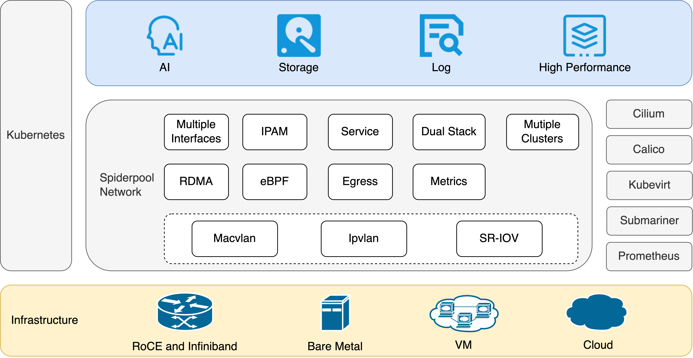

#

[**English**](./README.md) | **简体中文**

**作为一个 [CNCF Landscape 项目](https://landscape.cncf.io/card-mode?category=cloud-native-network&grouping=category)，Spiderpool 提供了一个 Kubernetes 的 underlay 和 RDMA 网络解决方案, 它能运行在裸金属、虚拟机和公有云上**

## Spiderpool 介绍

Spiderpool 是一个 kubernetes 的 underlay 和 RDMA 网络解决方案，它增强了 [Macvlan CNI](https://github.com/containernetworking/plugins/tree/main/plugins/main/macvlan),
[ipvlan CNI](https://github.com/containernetworking/plugins/tree/main/plugins/main/ipvlan),
[SR-IOV CNI](https://github.com/k8snetworkplumbingwg/sriov-cni) 的功能，满足了各种网络需求，使得 underlay 网络方案可应用在**裸金属、虚拟机和公有云环境**中，可为网络 I/O 密集性、低延时应用带来优秀的网络性能，包括**存储、中间件、AI 等应用**。详细的文档可参考[文档站](https://spidernet-io.github.io/spiderpool/)

## Underlay CNI 的优势

underlay CNI 主要指 macvlan、ipvlan、SR-IOV 等能够直接访问宿主机二层网络的 CNI 技术，它有如下优势：

* macvlan、ipvlan、SR-IOV 是承载 RDMA 网络加速的重要技术，RDMA 能为 AI 应用、延时敏感型应用、网络 I/O 密集型应用带来极大的性能提升，其网络性能大幅超过 overlay 网络解决方案。

* 区别于基于 veth 虚拟网卡的 CNI 解决方案，underlay 网络数据包避免了宿主机的三层网络转发，没有隧道封装开销，因此，它们能为应用提供了优秀的网络性能，包括优秀的网络吞吐量、低延时，节省了 CPU 的网络转发开销。

* 可直接对接 underlay 二层 VLAN 网络，应用可进行二层、三层网络通信，可进行组播、多播通信，数据包可受防火墙管控。

* 数据包携带 Pod 的真正 IP 地址，应用可直接基于 Pod IP 进行南北向通信，多云网络天然联通。

* underlay CNI 可基于宿主机不同的父网卡来创建虚拟机接口，因此可为存储、观测性等网络开销大的应用提供隔离的子网。

## Spiderpool 核心功能

* 简化安装和使用

  当前开源社区对于 underlay CNI 和 RDMA 的使用，需要手动安装 [Multus CNI](https://github.com/k8snetworkplumbingwg/multus-cni) 、RDMA、SR-IOV 等诸多相关组件，Spiderpool 简化了安装流程和运行 POD 数量，对相关的 CRD 进行了封装，提供了各种场景的完备文档，使得使用、管理更加便捷。

* 基于 CRD 的双栈 IPAM 能力

  提供了独享、共享的 IP 地址池，支持设置各种亲和性，为中间件等有状态应用和 kubevirt 等固定 IP 地址值，为无状态应用固定 IP 地址范围，自动化管理独享的 IP 池，优秀的 IP 回收避免 IP 泄露等。并且，具备优秀的 [IPAM 分配性能](./concepts/ipam-performance-zh_CN.md)。

* underlay 和 overlay CNI 的多网卡接入

  它包括了 “Pod 插入多个 underlay CNI 网卡”、“Pod 插入一个 overlay CNI 和 多个 underlay CNI 网卡”两种场景，Pod 具备多种 CNI 网卡，Spiderpool 能够为多个
  underlay CNI 网卡定制不同的 IP 地址，调协所有网卡之间的策略路由，以确保请求向和回复向数据路径一致而避免丢包。它能够为 [cilium](https://github.com/cilium/cilium), [calico](https://github.com/projectcalico/calico), [kubevirt](https://github.com/kubevirt/kubevirt) 等项目进行增强。

* 增强网络连通性

  众所周知，原生的 macvlan ipvlan SR-IOV 存在诸多通信限制。但是，Spiderpool 打通 Pod 和宿主机的连通性，确保 Pod 健康检测工作正常，并可通过 kube-proxy 或 eBPF kube-proxy replacement 使得 Pod 访问 service，支持 Pod 的 IP 冲突检测、网关可达性检测等。多集群网络可基于相同的 underlay 网络或者 [Submariner](https://github.com/submariner-io/submariner) 实现联通。

* eBPF 增强

  kube-proxy replacement 技术极大加速了访问 service 场景，同节点上的 socket 短路技术加速了本地 Pod 的通信效率。相比 kube proxy 解析方式，[网络延时有最大 25% 的改善，网络吞吐有 50% 的提高](./concepts/io-performance-zh_CN.md)。

* RDMA

  提供了基于 RoCE、infiniband 场景下的 RDMA 解决方案，POD 能够独享或共享使用 RDMA 设备，适合 AI 等网络性能需求高的应用。

* 网络双栈支持

  Spiderpool 组件和其提供的所有功能，支持 ipv4-only、ipv6-only、dual-stack 场景。

* 优秀的网络延时和吞吐量性能

  Spiderpool 在网络延时和吞吐量方面表现出色，超过了 overlay CNI，可参考 [性能报告](./concepts/io-performance-zh_CN.md)

* 指标

## 应用场景

Spiderpool 基于 underlay CNI 提供了比 overlay CNI 还优越的网络性能，可参考 [性能报告](./concepts/io-performance-zh_CN.md)。具体可应用在如下：

* 支持运行在裸金属、虚拟机、各大公有云厂商等环境，尤其为混合云提供了统一的 underlay CNI 解决方案。

* 传统的主机应用。它们希望直接使用 underlay 网络进行通信，例如直接访问 underlay 多子网、多播、组播、二层网络通信等，它们不能接受 overlay 网络的 NAT，希望进行无缝移植的 Kubernetes 。

* 中间件、数据存储、日志观测、AI 训练等网络 I/O 密集性应用

* 网络延时敏感型应用

## 快速开始

参考 [快速搭建](./usage/install/get-started-kind-zh_CN.md) 来使用 Spiderpool

参考 [使用](./usage/readme-zh_CN.md) 来了解各种功能的使用方法

参考 [架构](./concepts/arch-zh_CN.md) 来了解架构设计

## Roadmap

| 功能                               | macvlan  | ipvlan | SR-IOV    |
|----------------------------------|----------|---|-----------|
| Service By Kubeproxy             | Beta     |  Beta | Beta      |
| Service By Kubeproxy Replacement | Alpha    |  Alpha | Alpha     |
| Network Policy                   | In-plan  |  Alpha | In-plan   |
| Bandwidth                        | In-plan  | Alpha  | In-plan    |
| RDMA                             | Alpha    | Alpha | Alpha     |
| IPAM                             | Beta     | Beta | Beta      |
| Multi-Cluster                    | Alpha    | Alpha | Alpha     |
| Egress Policy                    | Alpha    | Alpha | Alpha     |
| 多网卡和路由调谐                         | beta     | beta | beta      |
| 适用场景                             | 裸金属      | 裸金属和虚拟机 | 裸金属       |

关于所有的功能规划，具体可参考 [roadmap](./develop/roadmap.md)

## Blogs

可参考 [Blogs](./concepts/blog-zh_CN.md)

## Governance

[Maintainers and Committers](./USERS.md)， 遵循 [governance document](./develop/CODE-OF-CONDUCT.md).

## 使用者

使用了 Spiderpool 项目的 [用户](./USERS.md).

## 参与开发

可参考 [开发搭建文档](./develop/contributing.md).

## 社区

Spiderpool 社区致力于营造一个开放和热情的环境，并通过多种方式与其他用户和开发人员互动。 您可以访问我们的 [社区网站](https://github.com/spidernet-io/community) 了解更多信息

* Slack: 如果你想在 CNCF Slack 加入 Spiderpool 的频道, 请先得到 CNCF Slack 的 **[邀请](https://slack.cncf.io/)**
  然后加入 [#Spiderpool](https://cloud-native.slack.com/messages/spiderpool) 的频道。

* 邮件: 您可以查看 [MAINTAINERS.md](https://github.com/spidernet-io/spiderpool/blob/main/MAINTAINERS.md) 获取所有维护者的邮箱地址， 联系邮箱地址以报告任何问题。

* 社区会议: 欢迎加入到我们每个月1号举行的[社区会议](https://docs.google.com/document/d/1tpNzxRWOz9-jVd30xGS2n5X02uXQuvqJAdNZzwBLTmI/edit?usp=sharing)，可以在这里讨论任何有关 Spiderpool 的问题。

* 微信群: 您可以扫描微信二维码，加入到 Spiderpool 技术交流群与我们进一步交流。

## License

Spiderpool is licensed under the Apache License, Version 2.0. See [LICENSE](./LICENSE) for the full license text.

&nbsp;&nbsp;
  
Spiderpool 丰富了 <a href="https://landscape.cncf.io/?selected=spiderpool">CNCF 云原生全景图</a>。

