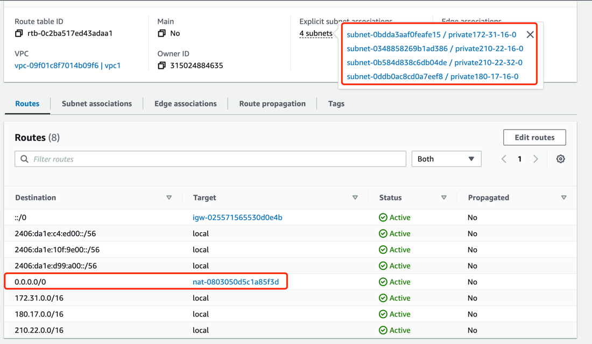
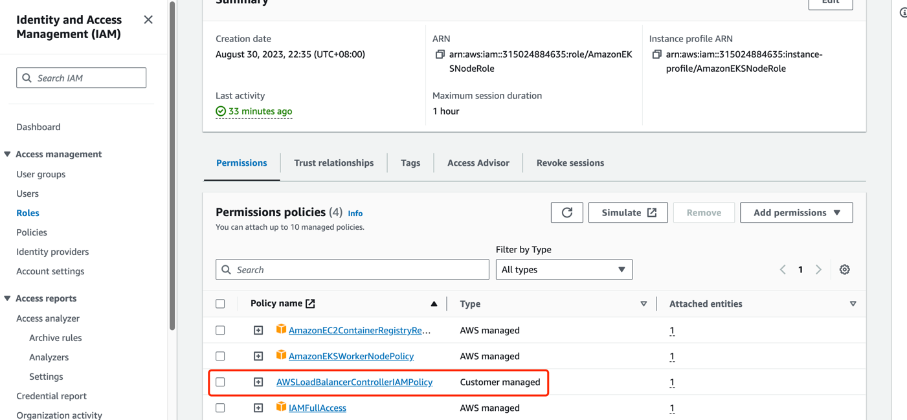

# AWS环境运行

**简体中文** | [**English**](./get-started-aws.md)

## 介绍

当前公有云厂商众多，如：阿里云、华为云、腾讯云、AWS 等，但当前开源社区的主流 CNI 插件难以以 Underlay 网络方式运行其上，只能使用每个公有云厂商的专有 CNI 插件，没有统一的公有云 Underlay 解决方案。本文将介绍一种适用于任意的公有云环境中的 Underlay 网络解决方案：[Spiderpool](../../../README-zh_CN.md) ，尤其是在混合云场景下，统一的 CNI 方案能够便于多云管理。

## 项目功能

Spiderpool 能基于 IPVlan Underlay CNI 运行在公有云环境上，并实现有节点拓扑、解决 MAC 地址合法性等功能，它的实现原理如下：

1. 公有云下使用 Underlay 网络，但公有云的每个云服务器的每张网卡只能分配有限的 IP 地址，当应用运行在某个云服务器上时，需要同步获取到 VPC 网络中分配给该云服务器不同网卡的合法 IP 地址，才能实现通信。根据上述分配 IP 的特点，Spiderpool 的 CRD：`SpiderIPPool` 可以设置 nodeName，multusName 实现节点拓扑的功能，通过 IP 池与节点、IPvlan Multus 配置的亲和性，能最大化的利用与管理节点可用的 IP 地址，给应用分配到合法的 IP 地址，让应用在 VPC 网络内自由通信，包括 Pod 与 Pod 通信，Pod 与云服务器通信等。

2. 公有云的 VPC 网络中，处于网络安全管控和数据包转发的原理，当网络数据报文中出现 VPC 网络未知的 MAC 和 IP 地址时，它无法得到正确的转发。例如，基于 Macvlan 和 OVS 原理的 Underlay CNI 插件，Pod 网卡中的 MAC 地址是新生成的，会导致 Pod 无法通信。针对该问题，Spiderpool 可搭配 [IPVlan](https://www.cni.dev/plugins/current/main/ipvlan/) CNI 进行解决。IPVlan 基于三层网络，无需依赖二层广播，并且不会重新生成 Mac 地址，与父接口保持一致，因此通过 IPvlan 可以解决公有云中关于 MAC 地址合法性的问题。

## 实施要求

1. 使用 IPVlan 做集群 CNI 时，系统内核版本必须大于 4.2。

2. 已安装 [Helm](https://helm.sh/docs/intro/install/)。

3. 了解 [AWS VPC 公有 & 私有子网](https://docs.aws.amazon.com/vpc/latest/userguide/configure-subnets.html) 基础知识。

    在 AWS VPC下创建的子网，如果设置了出口路由0.0.0.0/0, ::/0的下一跳为 Internet Gateway，则该子网就隶属于 *公有子网* ，否则就是 *私有子网* 。

    

## 步骤

### AWS环境

- 在 VPC 下创建公有子网以及私有子网，并在私有子网下创建虚拟机，如图：

    > 本例会在同一个 VPC 下先创建1个公有子网以及2个私有子网(请将子网部署在不同的可用区)，接着会在公有子网下创建一个 AWS EC2 实例作为跳板机，然后会在两个不同的私有子网下创建对应的 AWS EC2 实例用于部署 kubernetes 集群。

    

- 额外创建两个私有子网用于给实例补充第二张网卡(请将子网部署在与实例相同的可用区)，如图：

    

    

- 给实例们的每张网卡均分配一些辅助私网 IP，如图:

    > 因为根据 [AWS EC2实例规格](https://docs.aws.amazon.com/zh_cn/AWSEC2/latest/UserGuide/using-eni.html)，实例的网卡数量以及每张网卡对应可绑定的辅助IP有限制，为了能够尽可能的充分利用实例资源来部署应用，我们因此选择给实例绑定2张网卡以及对应的辅助IP.

    

    ```shell
    | Node    | ens5 primary IP | ens5 secondary IPs        | ens6 primary IP | ens6 secondary IPs        |  
    |---------|-----------------|---------------------------|-----------------|---------------------------|
    | master  | 172.31.22.228   | 172.31.16.4-172.31.16.8   | 210.22.16.10    | 210.22.16.11-210.22.16.15 |
    | worker1 | 180.17.16.17    | 180.17.16.11-180.17.16.15 | 210.22.32.10    | 210.22.32.11-210.22.32.15 |
    ```

- 创建 AWS NAT 网关，AWS 的 NAT 网关能实现为 VPC 私有子网中的实例连接到VPC外部的服务。通过 NAT 网关，实现集群的流量出口访问。参考 [NAT 网关文档](https://docs.aws.amazon.com/vpc/latest/userguide/vpc-nat-gateway.html) 创建 NAT 网关，如图：

    > 在上述的公有子网 `public-172-31-0-0` 下创建NAT网关，并为私有子网的路由表配置0.0.0.0/0出口路由的下一跳为该NAT网关。(注意IPv6是由AWS分配的全局唯一的地址，可直接借助Internet Gateway访问互联网)

    

    

- 使用上述配置的虚拟机，搭建一套 kubernetes 集群，节点的的可用 IP 及集群网络拓扑图如下：

    

### 安装Spiderpool

通过 helm 安装 Spiderpool。

```shell
helm repo add spiderpool https://spidernet-io.github.io/spiderpool

helm repo update spiderpool

helm install spiderpool spiderpool/spiderpool --namespace kube-system --set ipam.enableStatefulSet=false --set multus.multusCNI.defaultCniCRName="default/ipvlan-ens5"
```

> - 如果您使用的是中国大陆的云厂商服务器，可以指定参数 `--set global.imageRegistryOverride=ghcr.m.daocloud.io` ，以帮助您更快的拉取镜像。
>
> - Spiderpool 可以为控制器类型为：`Statefulset` 的应用副本固定 IP 地址。在公有云的 Underlay 网络场景中，云主机只能使用限定的 IP 地址，当 StatefulSet 类型的应用副本漂移到其他节点，但由于原固定的 IP 在其他节点是非法不可用的，新的 Pod 将出现网络不可用的问题。对此场景，将 `ipam.enableStatefulSet` 设置为 `false`，禁用该功能。
>
> - 通过 `multus.multusCNI.defaultCniCRName` 指定集群的 Multus clusterNetwork，clusterNetwork 是 Multus 插件的一个特定字段，用于指定 Pod 的默认网络接口。

### 安装 CNI 配置

Spiderpool 为简化书写 JSON 格式的 Multus CNI 配置，它提供了 SpiderMultusConfig CR 来自动管理 Multus NetworkAttachmentDefinition CR。根据前面创建 AWS EC2 实例虚拟机过程中创建的网卡情况，为虚拟机的每个用于运行 IPvlan CNI 的网卡创建如下 SpiderMultusConfig 配置的示例：

```shell
IPVLAN_MASTER_INTERFACE0="ens5"
IPVLAN_MULTUS_NAME0="ipvlan-$IPVLAN_MASTER_INTERFACE0"
IPVLAN_MASTER_INTERFACE1="ens6"
IPVLAN_MULTUS_NAME1="ipvlan-$IPVLAN_MASTER_INTERFACE1"

cat <<EOF | kubectl apply -f -
apiVersion: spiderpool.spidernet.io/v2beta1
kind: SpiderMultusConfig
metadata:
  name: ${IPVLAN_MULTUS_NAME0}
  namespace: default
spec:
  cniType: ipvlan
  ipvlan:
    master:
    - ${IPVLAN_MASTER_INTERFACE0}
---
apiVersion: spiderpool.spidernet.io/v2beta1
kind: SpiderMultusConfig
metadata:
  name: ${IPVLAN_MULTUS_NAME1}
  namespace: default
spec:
  cniType: ipvlan
  ipvlan:
    master:
    - ${IPVLAN_MASTER_INTERFACE1}
EOF
```

在本文示例中，使用如上配置，创建如下的两个 IPvlan SpiderMultusConfig，将基于它们自动生成的 Multus NetworkAttachmentDefinition CR，它们分别对应了宿主机的 `eth5` 与 `eth6` 网卡。

```bash
~# kubectl get spidermultusconfigs.spiderpool.spidernet.io -A
NAMESPACE     NAME                AGE
default       ipvlan-ens5   8d
default       ipvlan-ens6   8d

~# kubectl get network-attachment-definitions.k8s.cni.cncf.io -A
NAMESPACE     NAME                AGE
default       ipvlan-ens5   8d
default       ipvlan-ens6   8d
```

### 创建 IPPools

Spiderpool 的 CRD：`SpiderIPPool` 提供了 `nodeName`、`multusName` 与 `ips` 字段：

- `nodeName`：该字段限制当前 SpiderIPPool资源仅适用于哪些节点，若 Pod 所在节点符合该 `nodeName`，则能从该 SpiderIPPool 中成功分配出 IP，若 Pod 所在节点不符合 `nodeName`，则无法从该 SpiderIPPool 中分配出 IP。当该字段为空时，表明当前 Spiderpool 资源适用于集群中的所有节点。

- `multusName`：Spiderpool 通过该字段与 Multus CNI 深度结合以应对多网卡场景。当 `multusName` 不为空时，SpiderIPPool 会使用对应的 Multus CR 实例为 Pod 配置网络，若 `multusName` 对应的 Multus CR 不存在，那么 Spiderpool 将无法为 Pod 指定 Multus CR。当 `multusName` 为空时，Spiderpool 对 Pod 所使用的 Multus CR 不作限制。

- `spec.ips`：根据上文AWS EC2实例的网卡以及辅助IP地址等信息，故该值的范围必须在 `nodeName` 对应主机的辅助私网 IP 范围内，且对应唯一的一张实例网卡。

结合上文 [AWS环境](./get-started-aws-zh_CN.md#AWS环境) 每台实例的网卡以及对应的辅助IP信息，使用如下的 Yaml，为每个节点的每张网卡( ens5、ens6 )分别创建了一个 SpiderIPPool，它们将为不同节点上的 Pod 提供 IP 地址。

```shell
~# cat <<EOF | kubectl apply -f -
apiVersion: spiderpool.spidernet.io/v2beta1
kind: SpiderIPPool
metadata:
  name: master-v4-ens5
spec:
  ipVersion: 4
  subnet: 172.31.16.0/20
  ips:
    - 172.31.16.4-172.31.16.8
  gateway: 172.31.16.1
  default: true
  nodeName: ["master"]
  multusName: ["default/ipvlan-ens5"]
---
apiVersion: spiderpool.spidernet.io/v2beta1
kind: SpiderIPPool
metadata:
  name: master-v4-ens6
spec:
  ipVersion: 4
  subnet: 210.22.16.0/24
  ips:
    - 210.22.16.11-210.22.16.15
  gateway: 210.22.16.1
  default: true
  nodeName: ["master"]
  multusName: ["default/ipvlan-ens6"]
---
apiVersion: spiderpool.spidernet.io/v2beta1
kind: SpiderIPPool
metadata:
  name: worker1-v4-ens5
spec:
  ipVersion: 4
  subnet: 180.17.16.0/24
  ips:
    - 180.17.16.11-180.17.16.15
  gateway: 180.17.16.1
  default: true
  nodeName: ["worker1"]
  multusName: ["default/ipvlan-ens5"]
---
apiVersion: spiderpool.spidernet.io/v2beta1
kind: SpiderIPPool
metadata:
  name: worker1-v4-ens6
spec:
  ipVersion: 4
  subnet: 210.22.32.0/24
  ips:
    - 210.22.32.11-210.22.32.15
  gateway: 210.22.32.1
  default: true
  nodeName: ["worker1"]
  multusName: ["default/ipvlan-ens6"]
EOF
```

### 创建应用

以下的示例 Yaml 中，会创建1个 Deployment 应用，其中：

- `v1.multus-cni.io/default-network`：用于指定应用的 CNI 配置，示例中的应用选择使用对应于宿主机 ens5 的 IPvlan 配置，并根据我们的缺省 SpiderIPPool 资源默认挑选其对应的子网。

```shell
cat <<EOF | kubectl create -f -
apiVersion: apps/v1
kind: Deployment
metadata:
  name: nginx-lb-1
spec:
  selector:
    matchLabels:
      run: nginx-lb-1
  replicas: 2
  template:
    metadata:
      annotations:
        v1.multus-cni.io/default-network: "default/ipvlan-ens5"
      labels:
        run: nginx-lb-1
    spec:
      containers:
      - name: nginx-lb-1
        image: nginx
        ports:
        - containerPort: 80
EOF
```

查看 Pod 的运行状态我们可以发现，我们两个节点上都运行了1个 Pod 且使用的IP都对应宿主机的第一张网卡的辅助 IP:

```shell
~# kubectl get po -owide
NAME                          READY   STATUS    RESTARTS   AGE   IP             NODE      NOMINATED NODE   READINESS GATES
nginx-lb-1-55d4c48fc8-skrxh   1/1     Running   0          5s    172.31.16.5    master    <none>           <none>
nginx-lb-1-55d4c48fc8-jl8b9   1/1     Running   0          5s    180.17.16.14   worker1   <none>           <none>
```

### 测试集群东西向连通性

- 测试 Pod 与宿主机的通讯情况：

> export NODE_MASTER_IP=172.31.22.228  
> export NODE_WORKER1_IP= 180.17.16.17  
> ~# kubectl exec -it nginx-lb-1-55d4c48fc8-skrxh -- ping ${NODE_MASTER_IP} -c 1  
> ~# kubectl exec -it nginx-lb-1-55d4c48fc8-jl8b9 -- ping ${NODE_WORKER1_IP} -c 1  

- 测试 Pod 与跨节点、跨子网 Pod 的通讯情况

> ~# kubectl exec -it nginx-lb-1-55d4c48fc8-skrxh -- ping 180.17.16.14 -c 1

- 测试 Pod 与 ClusterIP 的通讯情况：

> ~# kubectl exec -it nginx-lb-1-55d4c48fc8-skrxh -- ping ${CLUSTER_IP} -c 1

### 测试集群南北向连通性

#### 集群内的 Pod 流量出口访问

借助上文我们创建的[AWS NAT网关](./get-started-aws-zh_CN.md#AWS环境)，我们的 VPC 私网已可实现访问互联网。

> ~# kubectl exec -it nginx-lb-1-55d4c48fc8-skrxh -- curl www.baidu.com -I

#### 负载均衡流量入口访问(可选)

##### 部署 AWS Load Balancer Controller

AWS 基础产品 `负载均衡` 拥有 NLB(Network Load Balancer) 和 ALB(Application Load Balancer) 两种模式分别对应 Layer4 与 Layer7。 aws-load-balancer-controller 是 AWS 提供的一个用于 kubernetes 与 AWS 基础产品进行对接的组件，可实现 kubernetes Service LoadBalancer 和 Ingress 功能。本文中通过该组件结合AWS基础设施完成负载均衡的流量入口访问。本例基于 `v2.6` 版本进行安装演示， 参考下列步骤与 [aws-load-balancer-controller 文档](https://kubernetes-sigs.github.io/aws-load-balancer-controller/v2.6/) 完成 aws-load-balancer-controller 的部署。

1. 集群节点配置 `providerID`

    务必为kubernetes上的每个 Node 设置上 providerID ，您可通过以下两种方式实现:
    - 可直接在AWS EC2 dashboard中找到instances的Instance ID.
    - 使用AWS CLI来查询Instance ID: `aws ec2 describe-instances --query 'Reservations[*].Instances[*].{Instance:InstanceId}'`.

2. 为AWS EC2实例所使用的 IAM role 补充 policy

    > 1. 介于 aws-load-balancer-controller 运行在每个节点上且需要访问 AWS 的 NLB/ALB APIs，因此需要 AWS IAM 关于NLB/ALB 相关请求的授权。又因我们是自建集群，我们需要借用节点自身的 IAM Role来实现授权，详情可看 [aws-load-balancer-controller IAM](aws-load-balancer-controller)。
    > 2. `curl -o iam-policy.json https://raw.githubusercontent.com/kubernetes-sigs/aws-load-balancer-controller/v2.6.0/docs/install/iam_policy.json`
    > 3. 使用如上获取的 json 内容，在 AWS IAM Dashboard 中创建一个新的policy，并将该 policy 与您当前虚拟机实例的 IAM Role 进行关联。
   
    

    

3. 为您AWS EC2实例所在的可用区创建一个public subnet并打上可自动发现的tag.

    - ALB 的使用需要至少2个跨可用区的子网，对于 NLB 的使用需要至少1个子网。详情请看 [子网自动发现](https://kubernetes-sigs.github.io/aws-load-balancer-controller/v2.6/deploy/subnet_discovery/)。 
    - 对于公网访问的 LB，您需要为实例所在可用区的 public subnet 打上 tag: `kubernetes.io/role/elb:1`，对于 VPC 间访问的 LB，请创建 private subnet 并打上 tag:`kubernetes.io/role/internal-elb:1`，请结合 [AWS 环境](./get-started-aws-zh_CN.md#AWS环境) 来创建所需的子网：
      - > 针对因特网暴露的负载均衡器，创建 public subnet: 在 AWS VPC Dashboard Subnets 栏选择创建子网，并选择与 EC2 相同的可用区。随后在 Route tables 栏选中我们的 Main 路由表并选择子网关联。(注意 Main 路由表的0.0.0.0/0路由的下一跳默认为 Internet 网关，若丢失请自行创建该路由规则)。
      - > 在 AWS VPC Dashboard Route tables栏创建一个新的路由表并配置 0.0.0.0/0的路由下一跳为 NAT 网关，::/0路由下一跳为 Internet 网关。
      - > 针对 VPC 间访问的负载均衡器，创建 private subnet: 在 AWS VPC Dashboard Subnets 栏选择创建子网，并选择与 EC2 相同的可用区。随后在 Route tables 栏选中上一步创建的路由表并选择子网关联。

4. 使用helm安装aws-load-balancer-controller(本例基于 `v2.6` 版本进行安装)

    ```shell
    helm repo add eks https://aws.github.io/eks-charts
    
    kubectl apply -k "github.com/aws/eks-charts/stable/aws-load-balancer-controller//crds?ref=master"
    
    helm install aws-load-balancer-controller eks/aws-load-balancer-controller -n kube-system --set clusterName=<cluster-name>
    ```

5. 检查 aws-load-balancer-controller 安装完成

    ```shell
    ~# kubectl get po -n kube-system | grep aws-load-balancer-controller
    NAME                                            READY   STATUS    RESTARTS       AGE
    aws-load-balancer-controller-5984487f57-q6qcq   1/1     Running   0              30s
    aws-load-balancer-controller-5984487f57-wdkxl   1/1     Running   0              30s
    ```

##### 为应用创建 Loadbalancer 负载均衡访问入口

集合上文中已创建的 [应用](./get-started-aws-zh_CN.md#创建应用), 我们为它创建一个 kubernetes Service LoadBalancer 资源(若有双栈需求请放开 `service.beta.kubernetes.io/aws-load-balancer-ip-address-type: dualstack` 注解):

```shell
cat <<EOF | kubectl create -f -
apiVersion: v1
kind: Service
metadata:
  name: nginx-svc-lb-1
  labels:
    run: nginx-lb-1
  annotations:
    service.beta.kubernetes.io/aws-load-balancer-nlb-target-type: ip
    service.beta.kubernetes.io/aws-load-balancer-scheme: internet-facing
    service.beta.kubernetes.io/aws-load-balancer-target-group-attributes: preserve_client_ip.enabled=true
    # service.beta.kubernetes.io/aws-load-balancer-ip-address-type: dualstack 
spec:
  type: LoadBalancer
  ports:
  - port: 80
    protocol: TCP
  selector:
    run: nginx-lb-1

EOF
```


我们可以在 AWS Dashboard EC2 Load Balancing 栏中看到已经有一个 NLB 已被创建出来且可被访问。

> - NLB 还可支持 instance 模式创建 LB，只需修改注解 `service.beta.kubernetes.io/aws-load-balancer-nlb-target-type` 即可，但因配合 `service.spec.externalTraffic=Local` 模式不支持监听节点漂移，因此不推荐使用。
> - 可通过注解 `service.beta.kubernetes.io/load-balancer-source-ranges` 来限制可访问源IP。(注意，该功能与注解 `service.beta.kubernetes.io/aws-load-balancer-ip-address-type` 关联，若默认 ipv4 则该值默认为 `0.0.0.0/0`, 若是 dualstack 则默认为 `0.0.0.0/0, ::/0`)。
> - 可通过注解 `service.beta.kubernetes.io/aws-load-balancer-scheme` 选择此 NLB 是暴露给公网访问还是留给 VPC 间访问，默认值为 `internal` 供 VPC 间访问。
> - 注解 `service.beta.kubernetes.io/aws-load-balancer-target-group-attributes: preserve_client_ip.enabled=true` 提供了客户端源 IP 保留功能。

##### 为应用创建 Ingress 访问入口

接下来我们通过 AWS EC2 中绑定的第二张网卡来创建一个kubernetes Ingress 资源(若有双栈需求请放开 `alb.ingress.kubernetes.io/ip-address-type: dualstack` 注解):

```shell
apiVersion: apps/v1
kind: Deployment
metadata:
  name: nginx-ingress
spec:
  selector:
    matchLabels:
      run: nginx-ingress
  replicas: 2
  template:
    metadata:
      annotations:
        v1.multus-cni.io/default-network: "default/ipvlan-ens6"
      labels:
        run: nginx-ingress
    spec:
      containers:
      - name: nginx-ingress
        image: nginx
        ports:
        - containerPort: 80
---
apiVersion: v1
kind: Service
metadata:
  name: nginx-svc-ingress
  labels:
    run: nginx-ingress
spec:
  type: NodePort
  ports:
  - port: 80
    protocol: TCP
  selector:
    run: nginx-ingress
---
apiVersion: apps/v1
kind: Deployment
metadata:
  name: echoserver
spec:
  selector:
    matchLabels:
      app: echoserver
  replicas: 2
  template:
    metadata:
      annotations:
        v1.multus-cni.io/default-network: "default/ipvlan-ens6"
      labels:
        app: echoserver
    spec:
      containers:
      - image: k8s.gcr.io/e2e-test-images/echoserver:2.5
        imagePullPolicy: Always
        name: echoserver
        ports:
        - containerPort: 8080
---
apiVersion: v1
kind: Service
metadata:
  name: echoserver
spec:
  ports:
    - port: 80
      targetPort: 8080
      protocol: TCP
  type: NodePort
  selector:
    app: echoserver
---
apiVersion: networking.k8s.io/v1
kind: Ingress
metadata:
  name: k8s-app-ingress
  annotations:
    alb.ingress.kubernetes.io/target-type: ip
    alb.ingress.kubernetes.io/scheme: internet-facing
    # alb.ingress.kubernetes.io/ip-address-type: dualstack
spec:
  ingressClassName: alb
  rules:
    - http:
        paths:
          - path: /
            pathType: Exact
            backend:
              service:
                name: nginx-svc-ingress
                port:
                  number: 80
    - http:
        paths:
          - path: /echo
            pathType: Exact
            backend:
              service:
                name: echoserver
                port:
                  number: 80
```


我们可以在 AWS Dashboard EC2 Load Balancing 栏中看到已经有一个 ALB 已被创建出来且可被访问。

> - ALB 也可支持 instance 模式创建 LB，只需修改注解 `alb.ingress.kubernetes.io/target-type`即可，但因配合 `service.spec.externalTraffic=Local` 模式不支持监听节点漂移，因此不推荐使用。
> - 使用 ALB 的 instance 模式需要指定 service 为nodePort模式。
> - 可通过注解 `alb.ingress.kubernetes.io/inbound-cidrs` 来限制可访问源IP。(注意，该功能与注解 `alb.ingress.kubernetes.io/ip-address-type` 关联，若默认 ipv4 则该值默认为 `0.0.0.0/0`, 若是 dualstack 则默认为 `0.0.0.0/0, ::/0`)。
> - 可通过注解 `alb.ingress.kubernetes.io/scheme` 选择此 ALB 是暴露给公网访问还是留给 VPC 间访问，默认值为 `internal` 供 VPC 间访问。
> - 若想整合多个 Ingress 资源共享同一个入口，可配置注解 `alb.ingress.kubernetes.io/group.name` 来显示指定一个名字。（注意，默认不指定该注解的 Ingresses 资源并不属于任何 IngressGroup，系统会将其视为由 Ingress 本身组成的 "隐式 IngressGroup"）
> - 如果想指定 Ingress 的 host，需要搭配 externalDNS 使用。(详情请查看 [配置 externalDNS](https://kubernetes-sigs.github.io/aws-load-balancer-controller/v2.6/guide/integrations/external_dns/))
