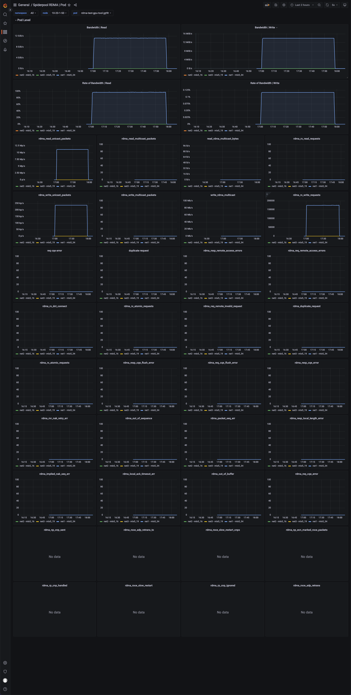
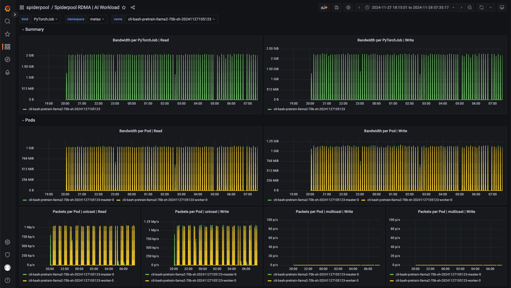

# RDMA Metrics

**English** ｜ [**简体中文**](./rdma-metrics-zh_CN.md)

RDMA is an efficient network communication technology that allows one computer to directly access the memory of another computer without involving the operating system, thus reducing latency and improving data transfer speed and efficiency. RDMA supports high-speed data transmission and reduces CPU load, making it ideal for scenarios requiring high-speed network communication.

In a Kubernetes cluster, the spiderpool CNI supports two RDMA scenarios: RoCE and IB. Pods can use the RDMA network card in either shared or exclusive modes. Users can choose the appropriate method based on their needs for utilizing RDMA network cards.

Spiderpool also provides an RDMA exporter feature and a Grafana monitoring panel. By monitoring the performance of Pod/Node RDMA networks in real-time, including throughput, latency, packet loss rate, etc., issues can be detected and measures taken to improve network reliability and performance.

## Common Scenarios for RDMA Metrics

1. **Performance Monitoring**:
    - **Throughput**: Measures the amount of data transmitted over the network.
    - **Latency**: Measures the time it takes for data to travel from source to destination.
    - **Packet Loss Rate**: Monitors the number of data packets lost during transmission.

2. **Error Detection**:
    - **Transmission Errors**: Detects errors in data transmission.
    - **Connection Failures**: Monitors failed connection attempts and disconnects.

3. **Network Health**:
    - **Congestion**: Detects network congestion and bottlenecks.

## How to Enable

```shell
helm upgrade --install spiderpool spiderpool/spiderpool --reuse-values --wait --namespace spiderpool --create-namespace \
  --set spiderpoolAgent.prometheus.enabled=true \
  --set spiderpoolAgent.prometheus.enabledRdmaMetric=true \
  --set grafanaDashboard.install=true \
  --set spiderpoolAgent.prometheus.serviceMonitor.install=true
```

- Use `--reuse-values` to reuse existing configurations.
- Use `--wait` to wait for all Pods to be running.
- Use `--namespace` to specify the Helm installation namespace.
- Use `--set spiderpoolAgent.prometheus.enabled` to enable Prometheus monitoring.
- Use `--set spiderpoolAgent.prometheus.enabledRdmaMetric=true` to enable the RDMA metric exporter.
- Use `-set grafanaDashboard.install=true` to install Grafana Dashboard (GrafanaDashboard requires the cluster to install [grafana-operator](https://github.com/ grafana/grafana-operator), or if you don't use it, you need to import the charts/spiderpool/files dashboard into your grafana).

## Metric Reference

Visit [Metrics Reference](../reference/metrics.md) to view detailed information about the metrics.

## Grafana Monitoring Dashboard

Among the following four monitoring dashboards, the RDMA Pod monitoring dashboard only displays monitoring data from SR-IOV Pods in the RDMA-isolated subsystem. As for macVLAN Pods, which use a shared mode, their RDMA network card data is not included in this dashboard.

The Grafana RDMA Cluster monitoring dashboard provides a view of the RDMA metrics for each node in the current cluster.  


The Grafana RDMA Node monitoring dashboard displays RDMA metrics for each physical NIC (Network Interface Card) and the bandwidth utilization of those NICs. It also includes statistics for VF NICs on the host node and monitoring metrics for Pods using RDMA NICs on that node.  
  

The Grafana RDMA Pod monitoring dashboard provides RDMA metrics for each NIC within a Pod, along with NIC error statistics. These metrics help in troubleshooting issues.  


The Grafana RDMA Workload monitoring dashboard is designed for monitoring RDMA metrics for top-level resources such as Jobs, Deployments, and KServers. These resources typically initiate a set of Pods for AI inference and training tasks.  

